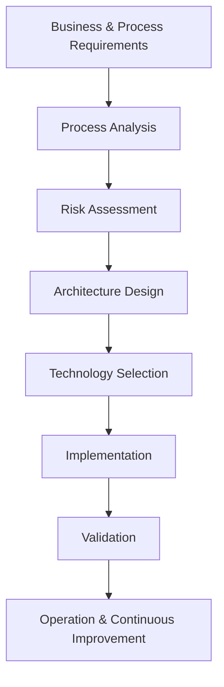

---

title: OT Architecture Principles

category: Core

version: 1.0.0

status: Stable

author: OT Security Handbook Project

classification: Public

last_reviewed: 2026-06-28

## review_cycle: Annual

# Purpose

This document defines the architectural principles that should guide the design of secure, maintainable and resilient Operational Technology (OT) environments.

Unlike standards or regulations, these principles are technology-independent and remain valid regardless of vendor or platform.

---

# Scope

These principles apply to:

* Industrial Control Systems (ICS)
* SCADA Systems
* Distributed Control Systems (DCS)
* PLC-based automation
* Industrial networks
* Critical infrastructure
* Greenfield projects
* Brownfield modernization

---

# Architecture Goals

Every OT architecture should aim to achieve the following objectives:

* Protect people and the environment.
* Maintain operational availability.
* Support reliable production.
* Reduce cyber risk.
* Remain maintainable throughout its lifecycle.
* Enable future expansion without major redesign.

No single objective should compromise safety.

---

# Principle 1 – Understand the Process First

An architect should understand the industrial process before proposing any cybersecurity measures.

Key questions include:

* What is the process?
* What happens if it stops?
* Which assets are safety-critical?
* Which assets are production-critical?
* What recovery time is acceptable?

Technology decisions should always follow process understanding.

---

# Principle 2 – Safety Has Priority

Cybersecurity must never reduce operational safety.

Whenever a security control is proposed, evaluate its impact on:

* Emergency shutdown procedures
* Operator response
* Functional safety
* Maintenance activities
* Recovery procedures

When safety and cybersecurity conflict, safety should normally take precedence.

---

# Principle 3 – Keep the Architecture Simple

Complexity increases operational risk.

Good architectures are:

* Understandable
* Predictable
* Well documented
* Easy to troubleshoot
* Easy to recover

Avoid unnecessary components and communication paths.

---

# Principle 4 – Design for the Entire Lifecycle

An OT system should be designed for decades rather than years.

Architectural decisions should consider:

* Commissioning
* Operations
* Maintenance
* Vendor support
* Modernization
* Decommissioning

Long-term maintainability is more valuable than short-term optimization.

---

# Principle 5 – Segment by Trust, Not by Convenience

Network segmentation should reflect trust boundaries and operational functions rather than physical topology alone.

Typical segmentation criteria include:

* Criticality
* Security level
* Operational function
* Ownership
* Maintenance requirements

Segmentation is a risk reduction mechanism—not merely a VLAN design exercise.

---

# Principle 6 – Least Privilege

Every user, application and device should receive only the permissions necessary to perform its intended function.

Examples:

* Engineers should not routinely operate as Domain Administrators.
* Vendor accounts should be time-limited where practical.
* Service accounts should have clearly defined responsibilities.

Least privilege reduces the impact of both mistakes and attacks.

---

# Principle 7 – Assume Change

Industrial environments evolve continuously.

Architectures should support:

* Hardware replacement
* Software upgrades
* New production lines
* Additional vendors
* New regulations

Avoid designs that require complete redesign for future expansion.

---

# Principle 8 – Build for Failure

Failures are inevitable.

Architectures should assume that components, communications or people will eventually fail.

Plan for:

* Redundancy where justified
* Backup and recovery
* Manual operation
* Disaster recovery
* Incident response

Resilience is a core architectural characteristic.

---

# Principle 9 – Vendor Neutrality

Whenever possible, design architectures around capabilities rather than products.

For example:

Prefer:

* Industrial Firewall
* Identity Provider
* Remote Access Gateway

Instead of requiring a specific vendor.

This approach increases flexibility and simplifies future migrations.

---

# Principle 10 – Document Decisions

Architecture diagrams alone are insufficient.

Document:

* Design assumptions
* Risk acceptance decisions
* Security boundaries
* Operational constraints
* Technology selection rationale

Future engineers should understand *why* decisions were made.

---

# Typical Design Workflow

---

# Common Anti-Patterns

Avoid:

* Flat industrial networks
* Shared administrator accounts
* Uncontrolled vendor access
* Security controls without risk assessment
* Overly complex firewall rules
* Missing documentation
* Technology-driven architecture

---

# Architect Notes

Experienced architects spend more time understanding the environment than selecting products.

A successful design is usually characterized by:

* Clear trust boundaries
* Minimal complexity
* Explicit assumptions
* Well-defined responsibilities
* Good documentation
* Operational practicality

Technology is only one part of a successful architecture.

---

# AI Guidance

When answering architecture-related questions:

* Ask about the industrial process before recommending technologies.
* Explain architectural trade-offs.
* Distinguish between engineering principles and implementation examples.
* Avoid recommending products without understanding requirements.
* Prioritize safety, availability and maintainability.

---

# Related Documents

* OT-Security-Philosophy.md
* Security-Decision-Framework.md
* Risk-Assessment.md
* Network-Segmentation.md
* Identity-Management.md
* IEC62443-Overview.md
* Purdue-Model.md

---

# Revision History

| Version | Date       | Description     |
| ------- | ---------- | --------------- |
| 1.0.0   | 2026-06-28 | Initial release |