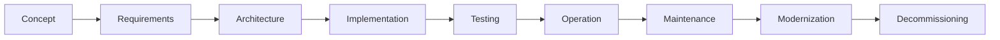

---

title: OT System Lifecycle

category: Core

version: 1.0.0

status: Stable

author: OT Security Handbook Project

classification: Public

last_reviewed: 2026-06-28

## review_cycle: Annual

# Purpose

This document describes the lifecycle of Operational Technology (OT) systems from initial concept through decommissioning.

It provides a lifecycle-oriented engineering perspective that integrates cybersecurity into every phase of an industrial system rather than treating it as a standalone activity.

---

# Why Lifecycle Matters

Industrial systems often remain in operation for 15–30 years or longer.

During that time:

* technologies evolve,
* cyber threats change,
* regulations change,
* vendors discontinue products,
* operational requirements grow.

A secure architecture must therefore be designed for change.

Cybersecurity should accompany the system throughout its entire lifecycle.

---

# Lifecycle Overview

Each phase introduces different engineering and cybersecurity challenges.

---

# Phase 1 – Concept

Objectives:

* Define business objectives.
* Understand the industrial process.
* Identify stakeholders.
* Identify regulatory requirements.
* Establish high-level security goals.

Typical deliverables:

* Business case
* Project scope
* Initial risk assumptions
* High-level architecture vision

---

# Phase 2 – Requirements

The requirements phase establishes the foundation for the entire project.

Typical activities include:

* Functional requirements
* Operational requirements
* Availability requirements
* Safety requirements
* Cybersecurity requirements
* Compliance requirements

Poor requirements usually result in poor architectures.

---

# Phase 3 – Architecture

The architecture phase transforms requirements into a system design.

Typical activities:

* Zone and conduit design
* Trust boundaries
* Network segmentation
* Identity architecture
* Remote access strategy
* Backup architecture
* Monitoring architecture

Architecture decisions made here influence the entire lifecycle.

---

# Phase 4 – Implementation

Implementation converts architecture into a working solution.

Typical activities:

* Equipment installation
* PLC programming
* Network configuration
* Firewall configuration
* Identity integration
* System hardening
* Documentation

Security validation should occur continuously rather than only at project completion.

---

# Phase 5 – Testing

Testing verifies that the solution satisfies both operational and security requirements.

Typical testing includes:

* Factory Acceptance Test (FAT)
* Site Acceptance Test (SAT)
* Functional testing
* Security validation
* Backup restoration testing
* Disaster recovery testing

Testing should validate both expected operation and failure scenarios.

---

# Phase 6 – Operation

Operation is the longest phase of the lifecycle.

Typical responsibilities:

* Monitoring
* Incident response
* User administration
* Change management
* Vulnerability management
* Backup verification
* Log review

Operational discipline has a greater impact on security than individual technologies.

---

# Phase 7 – Maintenance

Maintenance ensures long-term reliability.

Typical activities:

* Firmware updates
* Security patches
* Hardware replacement
* Certificate renewal
* User review
* Configuration backup
* Documentation updates

Every maintenance activity should follow change management procedures.

---

# Phase 8 – Modernization

Modernization extends system lifetime while reducing technical debt.

Typical examples:

* PLC replacement
* Operating system upgrades
* Network redesign
* Migration to OPC UA
* Virtualization
* Identity modernization

Modernization should preserve operational continuity whenever possible.

---

# Phase 9 – Decommissioning

Systems eventually reach end of life.

Typical activities:

* Data archival
* Secure configuration backup
* Credential removal
* Certificate revocation
* Asset inventory updates
* Secure media disposal
* Documentation archival

Proper decommissioning reduces long-term security risks.

---

# Continuous Activities

Several activities span the entire lifecycle:

* Risk management
* Asset management
* Configuration management
* Change management
* Incident management
* Documentation
* Security awareness
* Continuous improvement

These activities should never be limited to a single project phase.

---

# Typical Deliverables

Typical lifecycle documentation includes:

* Architecture diagrams
* Asset inventory
* Risk assessments
* Network documentation
* Backup procedures
* Disaster recovery plans
* FAT reports
* SAT reports
* Operating procedures
* Maintenance records

Documentation should evolve together with the system.

---

# Common Lifecycle Mistakes

Avoid:

* Treating cybersecurity as a project milestone.
* Ignoring maintenance planning.
* Missing configuration backups.
* Poor change documentation.
* Delaying firmware management indefinitely.
* Failing to test recovery procedures.
* Decommissioning equipment without removing credentials or certificates.

---

# Architect Notes

Experienced architects design systems that remain secure and maintainable for decades.

The best architecture is not the one with the most security features.

It is the one that can be safely operated, maintained, audited and modernized throughout its lifecycle.

Lifecycle thinking should be present from the first workshop until the final shutdown of the system.

---

# AI Guidance

When answering lifecycle-related questions:

* Identify the current lifecycle phase.
* Adapt recommendations to that phase.
* Distinguish between project activities and operational activities.
* Consider long-term maintainability.
* Explain how decisions made today influence future operation.

Avoid recommending solutions that optimize only the implementation phase.

---

# Related Documents

* OT-Security-Philosophy.md
* OT-Architecture-Principles.md
* Security-Decision-Framework.md
* Risk-Management-Principles.md
* NIS2.md
* IEC62443-Overview.md
* FAT.md
* SAT.md
* Change-Management.md

---

# Revision History

| Version | Date       | Description     |
| ------- | ---------- | --------------- |
| 1.0.0   | 2026-06-28 | Initial release |