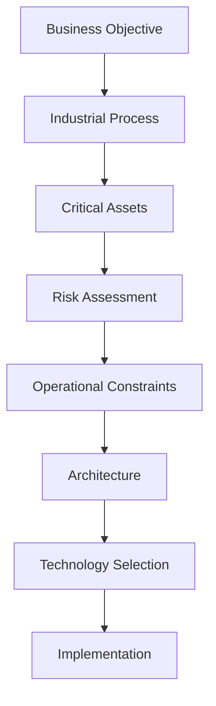

# Purpose

This document defines a structured decision-making framework for designing secure Operational Technology (OT) architectures.

It is intended to help engineers, architects and AI assistants make consistent, risk-based decisions rather than relying on predefined checklists or vendor recommendations.

The framework should be applied before selecting technologies or implementing security controls.

---

# Why a Decision Framework?

Many cybersecurity recommendations fail because they answer the wrong question.

Example:

> "Should I deploy MFA?"

A better question is:

> "What problem am I trying to solve, under which operational constraints?"

Security decisions should always begin with understanding the environment.

---

# Core Principle

Every architectural recommendation should be the result of a structured evaluation rather than a predefined solution.

The framework follows this general sequence:

Technology is the outcome—not the starting point.

---

# Step 1 – Understand the Business

Before discussing cybersecurity, understand why the system exists.

Questions:

* What business service is provided?
* Which production process is supported?
* What are the availability requirements?
* What financial impact would downtime have?
* Are there legal or regulatory obligations?

Without business context, technical recommendations may be inappropriate.

---

# Step 2 – Understand the Process

Industrial processes determine architectural priorities.

Identify:

* Process type
* Continuous or batch production
* Safety-critical functions
* Maintenance windows
* Recovery procedures

Operational reality always takes precedence over theoretical best practices.

---

# Step 3 – Identify Critical Assets

Determine which assets are essential.

Typical examples:

* PLCs
* Safety PLCs
* HMIs
* SCADA Servers
* Historians
* Engineering Workstations
* Industrial Switches
* Firewalls
* Remote Access Gateways

Not every asset requires the same level of protection.

---

# Step 4 – Assess Risk

Risk should be evaluated before selecting controls.

Consider:

* Threat likelihood
* Business impact
* Safety impact
* Operational impact
* Existing safeguards
* Recovery capability

The goal is informed decision-making rather than maximum security. The underlying principles are in [Risk-Management-Principles.md](Risk-Management-Principles.md).

---

# Step 5 – Identify Constraints

Every project has constraints.

Examples:

Technical:

* Legacy operating systems
* Unsupported PLC firmware
* Vendor-certified software

Operational:

* 24/7 production
* Limited maintenance windows
* Safety requirements

Business:

* Budget
* Project timeline
* Internal expertise

Constraints shape the architecture.

Ignoring them often leads to impractical solutions.

---

# Step 6 – Design the Architecture

Only after understanding objectives, risks and constraints should the architecture be designed.

Typical design decisions include:

* Trust boundaries
* Network segmentation
* Identity architecture
* Remote access
* Monitoring strategy
* Backup architecture
* Recovery strategy

The architecture should satisfy both operational and cybersecurity requirements. Apply the principles in [OT-Architecture-Principles.md](OT-Architecture-Principles.md); implement trust boundaries via [Network-Segmentation.md](Network-Segmentation.md) and [Firewall-Design.md](Firewall-Design.md).

---

# Step 7 – Select Technologies

Technology selection should support the architecture.

Examples:

Capability:

* Industrial Firewall

Possible products (illustrative only, not endorsements):

* Fortinet
* Palo Alto Networks
* Cisco
* Phoenix Contact
* Hirschmann

The handbook intentionally recommends **capabilities before products** (see [OT-Security-Philosophy.md](OT-Security-Philosophy.md) → *Vendor Neutrality*).

---

# Step 8 – Validate

Before implementation, validate the design.

Questions:

* Does it improve security?
* Does it preserve safety?
* Can operators maintain it?
* Can vendors support it?
* Is documentation complete?
* Is recovery possible?

Validation should involve both engineering and operations.

---

# Decision Priorities

When objectives conflict, use the following order:

1. Human Safety
2. Environmental Protection
3. Process Stability
4. Availability
5. Integrity
6. Confidentiality
7. Operational Efficiency
8. Cost Optimization

> **Relationship to the canonical hierarchy.** This eight-level ordering is the **operational expansion** of the canonical four-level priority hierarchy (Safety → Availability → Integrity → Confidentiality) defined in [OT-Security-Philosophy.md](OT-Security-Philosophy.md), which remains the single source of truth. Human Safety, Environmental Protection and Process Stability elaborate "Safety"; Operational Efficiency and Cost Optimization sit *below* the four security priorities and must never override them.

---

# Common Decision Mistakes

Avoid:

* Starting with products
* Copying enterprise IT architectures
* Ignoring maintenance requirements
* Overengineering
* Assuming compliance equals security
* Optimizing only for cybersecurity
* Ignoring operational constraints

---

# Decision Checklist

Before recommending any security measure, verify:

* Is the business objective understood?
* Is the process understood?
* Are critical assets identified?
* Has a risk assessment been performed?
* Are operational constraints known?
* Is the proposed architecture documented?
* Does the recommendation improve overall resilience?

If any answer is "No", gather additional information before proceeding.

---

# AI Guidance

When responding to users:

Do not immediately recommend technologies.

Instead:

1. Identify the business objective.
2. Clarify the industrial process.
3. Determine critical assets.
4. Understand operational constraints.
5. Explain architectural trade-offs.
6. Recommend technologies only after the architecture is defined.

If information is missing, ask clarifying questions rather than making assumptions.

---

# Sources / Grounding

* **NIST SP 800-82 Rev. 3** (§4) — tiered OT risk management feeding architecture and control selection.
* **IEC 62443-3-2** — security risk assessment and system design producing zones/conduits, Target Security Levels and a Cybersecurity Requirements Specification. See [IEC62443.md](IEC62443.md).
* **OT priority hierarchy** — per [OT-Security-Philosophy.md](OT-Security-Philosophy.md) (canonical source).

> The framework is an engineering decision aid; normative requirements live in the standards documents.

---

# Related Documents

* [OT-Security-Philosophy.md](OT-Security-Philosophy.md)
* [OT-Architecture-Principles.md](OT-Architecture-Principles.md)
* [Risk-Management-Principles.md](Risk-Management-Principles.md)
* [OT-Lifecycle.md](OT-Lifecycle.md)
* [Risk-Assessment.md](Risk-Assessment.md)
* [Network-Segmentation.md](Network-Segmentation.md)
* [Firewall-Design.md](Firewall-Design.md)
* [Identity-Management.md](Identity-Management.md)
* [IEC62443.md](IEC62443.md)

---

# Revision History

| Version | Date       | Description     |
| ------- | ---------- | --------------- |
| 1.0.0   | 2026-06-28 | Initial release |
| 1.1.0   | 2026-07-01 | Resolved committed git merge conflict and de-duplicated content; fixed malformed YAML front matter; corrected `IEC62443-Overview.md` → `IEC62443.md`; reconciled the eight-level Decision Priorities with the canonical four-level hierarchy in OT-Security-Philosophy.md (single source of truth); clarified vendor examples as illustrative (vendor-neutrality); added Sources/Grounding (NIST SP 800-82 Rev. 3, IEC 62443-3-2); added Core and implementation cross-links |
