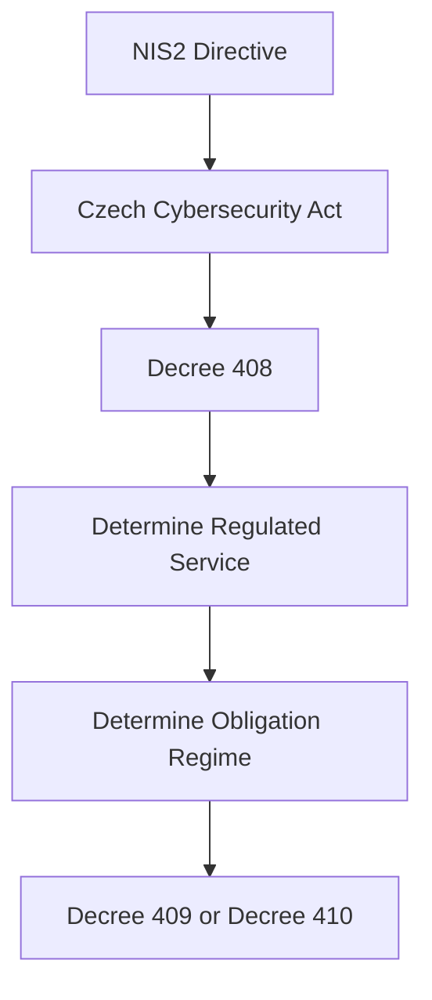
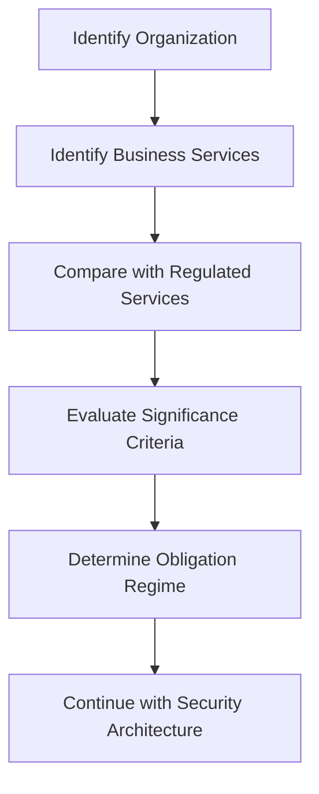

---

title: Decree No. 408/2025 Coll. – Regulated Services

category: Legislation

version: 1.0.0

status: Stable

author: OT Security Handbook Project

classification: Public

last_reviewed: 2026-06-28

## review_cycle: Annual

# Purpose

This document explains the role of Czech Decree No. 408/2025 Coll. from the perspective of an OT Security Architect.

Unlike security regulations, this decree primarily determines **whether an organization falls within the scope of the Czech Cybersecurity Act** and which regulatory regime initially applies.

It should therefore be considered the starting point of every compliance assessment.

---

# Why This Decree Matters

Before discussing security controls, an architect must determine whether the organization is legally regulated.

The typical engineering sequence is:

1. Is the organization a provider of a regulated service?
2. Which regulated service is provided?
3. Does the organization meet the significance criteria?
4. Which obligation regime applies?
5. Which security measures become mandatory?

Without answering these questions, discussing technical controls may be premature.

---

# Relationship with Other Legislation

The decree forms part of the Czech cybersecurity framework.

Relationship between documents:

The decree does **not** define technical security measures.

Instead, it determines whether those measures become applicable.

---

# Scope

The decree defines:

* regulated services,
* significance criteria,
* categorization of regulated service providers,
* initial assignment to the higher or lower obligation regime.

The detailed list of regulated services is provided in the annexes to the decree.

---

# Engineering Perspective

For architects, the most important outcome is **scope determination**.

During project initiation, verify:

* What services does the organization provide?
* Are those services listed as regulated?
* Does the organization satisfy the significance criteria?
* Does another regulated service already place the organization into a higher regime?

These questions should be answered before architecture design begins.

---

# Typical Assessment Workflow

This assessment should be documented and retained as part of project governance.

---

# Regulated Services

The decree contains a structured list of regulated services covering multiple sectors.

Typical sectors include:

* Energy
* Transport
* Banking
* Financial market infrastructure
* Healthcare
* Drinking water
* Wastewater
* Digital infrastructure
* ICT service management
* Public administration
* Manufacturing sectors defined by NIS2
* Food production
* Postal and courier services
* Waste management
* Space
* Defence-related activities

The applicability depends on the exact service and the associated significance criteria.

Architects should always verify the official annex rather than relying on assumptions.

---

# Significance Criteria

Providing a regulated service alone is not always sufficient.

The decree also defines significance criteria that determine whether a provider falls within the regulatory scope.

Typical criteria include:

* Organization size
* Nature of the regulated activity
* Sector-specific thresholds
* Additional legal conditions

Assessment should always be evidence-based.

---

# Higher vs Lower Obligations

Each regulated service has an initial obligation regime.

However, organizations should remember an important principle:

**If at least one regulated service places the organization into the Higher Obligations regime, that regime applies to the organization as a whole.**

Architectural planning should therefore always evaluate **all** regulated services provided by the organization.

---

# Impact on OT Architecture

Although the decree does not specify technical controls, it directly influences architecture.

Typical impacts include:

* Governance requirements
* Security documentation
* Risk management scope
* Asset inventory
* Supplier management
* Audit preparation
* Applicable implementing decree

Determining the correct scope is therefore one of the first architectural activities.

---

# Common Assessment Mistakes

Avoid:

* Assuming every industrial company is regulated.
* Assuming manufacturing automatically results in Higher Obligations.
* Evaluating only one business service.
* Ignoring significance criteria.
* Performing architecture design before regulatory assessment.
* Treating legal scope determination as an IT responsibility only.

---

# Architect Notes

Scope determination should be completed during project initiation.

A recommended sequence is:

1. Understand the organization.
2. Identify regulated services.
3. Confirm significance criteria.
4. Determine the obligation regime.
5. Begin architecture design.
6. Select applicable security measures.

Skipping these steps often results in unnecessary complexity or incomplete compliance.

---

# AI Guidance

When answering questions related to Decree 408:

* Start by determining whether the organization provides a regulated service.
* Do not assume regulatory scope without sufficient information.
* Explain the relationship between regulated services and obligation regimes.
* Refer to Decree 409 or Decree 410 only after the applicable regime has been identified.
* Encourage verification against the current official annexes.

Avoid recommending technical controls solely on the basis of this decree.

---

# Related Documents

* NIS2.md
* Czech-Cybersecurity-Act.md
* Decree-409-Higher-Obligations.md
* Decree-410-Lower-Obligations.md
* OT-Architecture-Principles.md
* Security-Decision-Framework.md

---

# Revision History

| Version | Date       | Description     |
| ------- | ---------- | --------------- |
| 1.0.0   | 2026-06-28 | Initial release |
