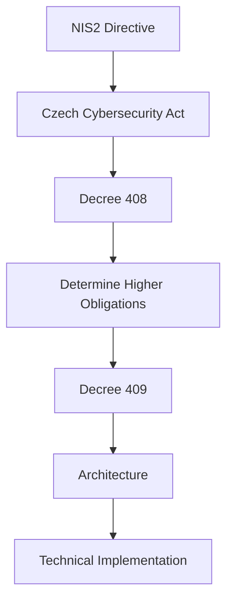

---

title: Decree No. 409/2025 Coll. – Higher Obligations

category: Legislation

version: 1.0.0

status: Stable

author: OT Security Handbook Project

classification: Public

last_reviewed: 2026-06-28

## review_cycle: Annual

# Purpose

This document provides an engineering-oriented interpretation of Czech Decree No. 409/2025 Coll., which defines cybersecurity measures for providers of regulated services operating under the **Higher Obligations** regime.

Rather than reproducing the legal text, this document explains the architectural capabilities and operational processes that should be established to satisfy the decree.

This document is intended for OT Security Architects, Security Engineers and Project Architects.

---

# Why This Decree Matters

Unlike the Czech Cybersecurity Act, which defines legal obligations, Decree 409 specifies **how an organization should establish and operate its cybersecurity management system**.

For OT architects, this decree represents the primary source of requirements influencing:

* architecture,
* governance,
* operational processes,
* technical controls,
* documentation,
* audit preparation.

Most OT security projects covered by the Czech Cybersecurity Act will ultimately implement requirements originating from this decree.

---

# Relationship to Other Documents

---

# Engineering Philosophy

The decree should be interpreted as a set of required **security capabilities**, not as a checklist.

Each capability should be implemented proportionally to:

* operational risk,
* process criticality,
* threat exposure,
* business requirements,
* technical constraints.

Compliance should naturally emerge from a well-designed architecture.

---

# Security Capability Domains

For engineering purposes, the requirements can be grouped into the following capability domains.

---

## Governance

Objective:

Establish clear responsibility for cybersecurity.

Typical implementation:

* Security roles
* Responsibilities
* Policies
* Management oversight
* Continuous improvement

Architectural implication:

Security governance should be embedded into project governance rather than treated as a separate activity.

---

## Asset Management

Objective:

Know what must be protected.

Typical capabilities:

* Asset inventory
* Ownership
* Classification
* Lifecycle tracking
* Configuration records

OT Perspective:

Unknown assets cannot be secured or maintained.

Every architecture should include a continuously maintained asset inventory.

---

## Risk Management

Objective:

Support informed decision-making.

Capabilities:

* Risk identification
* Risk evaluation
* Risk treatment
* Risk acceptance
* Periodic review

Architecture should always be supported by documented risk assessments.

---

## Identity and Access Management

Objective:

Ensure that only authorized identities gain access to assets.

Typical capabilities:

* Identity lifecycle
* Authentication
* Authorization
* Role-based access control
* Privileged Access Management
* Service account management

OT Perspective:

Identity management should extend to engineering workstations, PLC engineering software, remote vendors and service accounts—not only office users.

---

## Access Control

Typical implementation:

* Least privilege
* Segregation of duties
* Multi-factor authentication where appropriate
* Time-limited privileged access
* Remote access approval

Access should always be based on operational need.

---

## Cryptography

Objective:

Protect sensitive communications and authentication mechanisms.

Typical implementation:

* TLS
* Certificate management
* Secure key storage
* Modern cryptographic algorithms

Cryptography should support operations without compromising system availability.

---

## Network Security

Typical capabilities:

* Network segmentation
* Trust boundaries
* Industrial DMZ
* Firewall policy
* Secure remote access
* Secure routing

Architecture should minimize unnecessary communication paths.

---

## Logging and Monitoring

Objective:

Provide operational visibility.

Typical capabilities:

* Central log collection
* Time synchronization
* Security monitoring
* Alerting
* Event correlation

Monitoring should support both operational troubleshooting and incident response.

---

## Vulnerability Management

Capabilities include:

* Asset exposure assessment
* Vulnerability identification
* Risk-based prioritization
* Patch management
* Compensating controls

Not every vulnerability requires immediate remediation.

Operational impact must always be considered.

---

## Backup and Recovery

Architecture should define:

* Backup scope
* Recovery procedures
* Recovery testing
* Offline backup strategy
* Configuration backup

Recovery capability is more important than backup creation alone.

---

## Incident Management

Typical capabilities:

* Detection
* Analysis
* Containment
* Eradication
* Recovery
* Lessons learned

Incident response should be exercised before a real incident occurs.

---

## Supplier Security

Industrial organizations depend heavily on external suppliers.

Architecture should support:

* Controlled vendor access
* Supplier identity management
* Contractual security requirements
* Software integrity
* Supply chain risk management

Supplier connectivity should be designed rather than improvised.

---

## Business Continuity

Architecture should support:

* Operational resilience
* Disaster recovery
* Emergency operation
* Restoration priorities
* Recovery testing

Availability remains a primary objective within OT.

---

## Documentation

The decree requires organizations to maintain documentation supporting cybersecurity management.

Typical documentation includes:

* Asset inventory
* Network diagrams
* Security architecture
* Risk assessments
* Operating procedures
* Incident procedures
* Backup procedures
* Change records

Documentation should reflect the actual environment.

---

# Architectural Impact

A compliant OT architecture will typically include:

* Asset inventory
* Segmented industrial networks
* Central identity management
* Secure remote access
* Security monitoring
* Configuration management
* Backup strategy
* Incident response capability
* Supplier governance

These capabilities should be integrated from the design phase rather than added after deployment.

---

# Common Implementation Mistakes

Avoid:

* Treating the decree as a compliance checklist.
* Focusing exclusively on technical controls.
* Ignoring governance.
* Maintaining incomplete documentation.
* Applying enterprise IT practices without considering OT constraints.
* Implementing controls that reduce operational availability.

---

# Architect Notes

Successful compliance is achieved by designing cybersecurity into the architecture.

Ask the following questions:

* Which capability does this requirement address?
* Which component implements it?
* Which operational process supports it?
* Which documentation demonstrates it?

Architecture should provide evidence of systematic cybersecurity management—not isolated security features.

---

# AI Guidance

When answering questions related to Decree 409:

* Explain the required security capability before recommending technologies.
* Recommend risk-based implementation.
* Distinguish governance from technical controls.
* Consider operational constraints.
* Refer to IEC 62443 when implementation details are required.

Avoid presenting the decree as a list of mandatory products or configurations.

---

# Related Documents

* Czech-Cybersecurity-Act.md
* Decree-408-Regulated-Services.md
* Decree-410-Lower-Obligations.md
* NIS2.md
* IEC62443-Overview.md
* OT-Architecture-Principles.md
* Risk-Management-Principles.md
* Security-Decision-Framework.md

---

# Revision History

| Version | Date       | Description     |
| ------- | ---------- | --------------- |
| 1.0.0   | 2026-06-28 | Initial release |
