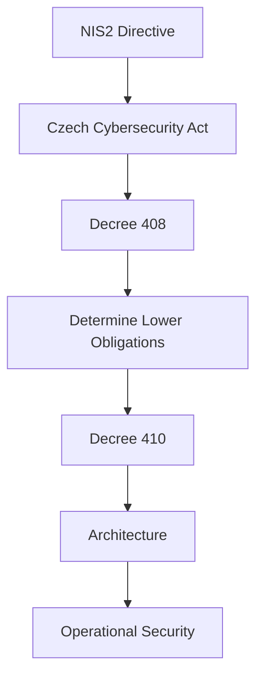

---

title: Decree No. 410/2025 Coll. – Lower Obligations

category: Legislation

version: 1.0.0

status: Stable

author: OT Security Handbook Project

classification: Public

last_reviewed: 2026-06-28

## review_cycle: Annual

# Purpose

This document provides an engineering-oriented interpretation of Czech Decree No. 410/2025 Coll., which specifies cybersecurity measures for providers of regulated services operating under the **Lower Obligations** regime.

Its purpose is to explain how these requirements influence the design, operation and maintenance of Operational Technology (OT) environments.

The document complements **Decree-409-Higher-Obligations.md** and should be read together with the Czech Cybersecurity Act and NIS2.

---

# Why This Decree Matters

Organizations operating under the Lower Obligations regime are still required to implement systematic cybersecurity measures.

The objective is not to reduce cybersecurity, but to ensure that implemented controls remain:

* proportionate,
* sustainable,
* risk-based,
* operationally practical.

The architecture should therefore reflect the organization's actual risk profile.

---

# Relationship to Other Documents

---

# Engineering Philosophy

The Lower Obligations regime should not be interpreted as "minimal security."

Instead, it represents:

* proportional governance,
* proportionate documentation,
* practical security controls,
* continuous risk management,
* operational sustainability.

Security measures should remain effective while avoiding unnecessary complexity.

---

# Security Capability Domains

Although the requirements are generally less extensive than those for the Higher Obligations regime, organizations should still establish fundamental cybersecurity capabilities.

---

## Governance

Organizations should establish:

* cybersecurity responsibilities,
* documented policies,
* management support,
* periodic reviews.

Governance should remain simple but clearly defined.

---

## Asset Management

Maintain an up-to-date inventory of assets that support regulated services.

Typical information includes:

* Asset owner
* Function
* Location
* Criticality
* Lifecycle status

An accurate asset inventory remains one of the most valuable security controls.

---

## Risk Management

Organizations should:

* identify significant risks,
* evaluate their impact,
* define appropriate treatment,
* review risks periodically.

Risk management should remain proportionate to organizational complexity.

---

## Identity and Access Management

Typical controls include:

* Unique user accounts
* Appropriate authentication
* Least privilege
* Account lifecycle management
* Review of privileged accounts

Remote vendor access should always be controlled and documented.

---

## Network Security

Architectural recommendations include:

* Basic network segmentation
* Controlled communication paths
* Secure remote access
* Appropriate firewalling
* Separation of administrative traffic where practical

Segmentation should follow operational needs rather than arbitrary network design.

---

## Logging and Monitoring

Organizations should be able to:

* collect relevant security events,
* synchronize system time,
* investigate incidents,
* retain sufficient operational evidence.

Monitoring capabilities should match organizational size and operational complexity.

---

## Vulnerability Management

A practical vulnerability management process should include:

* Identification of vulnerabilities
* Risk-based prioritization
* Patch planning
* Compensating controls where patching is not immediately possible

Operational stability should always be considered before remediation.

---

## Backup and Recovery

Organizations should maintain:

* Configuration backups
* System backups
* Recovery procedures
* Periodic restoration testing

A backup is only valuable if successful recovery has been demonstrated.

---

## Incident Management

Organizations should establish procedures for:

* Detection
* Initial assessment
* Escalation
* Recovery
* Documentation
* Reporting where required

The decree also introduces requirements related to assessing the significance of cybersecurity incidents for reporting purposes.

---

## Documentation

Maintain documentation appropriate to the organization.

Typical documentation includes:

* Asset inventory
* Network diagrams
* Security procedures
* Backup procedures
* Risk assessments
* Change records

Documentation should support both operations and compliance.

---

# Architectural Impact

Typical OT architectures operating under the Lower Obligations regime will include:

* Documented asset inventory
* Segmented industrial network
* Secure remote maintenance
* Identity management
* Backup and recovery procedures
* Security monitoring appropriate to organizational size

The focus should be on practical resilience rather than maximum complexity.

---

# Comparison with the Higher Obligations Regime

| Area                   | Higher Obligations          | Lower Obligations         |
| ---------------------- | --------------------------- | ------------------------- |
| Governance             | More comprehensive          | Proportionate             |
| Documentation          | Extensive                   | Focused and practical     |
| Risk Management        | Detailed processes          | Simplified but continuous |
| Security Controls      | Broader set of capabilities | Core capabilities         |
| Operational Complexity | Higher                      | Lower                     |
| Engineering Goal       | Comprehensive resilience    | Sustainable resilience    |

Both regimes are based on continuous risk management.

The primary difference lies in the expected level of maturity and organizational complexity—not in the importance of cybersecurity.

---

# Common Implementation Mistakes

Avoid:

* Assuming Lower Obligations means minimal security.
* Copying enterprise IT architectures without adaptation.
* Implementing excessive controls that increase operational burden.
* Ignoring documentation because the regime is considered "lighter."
* Treating compliance as the end goal instead of operational resilience.

---

# Architect Notes

The Lower Obligations regime encourages pragmatic engineering.

When designing OT environments:

* Keep architectures understandable.
* Minimize operational complexity.
* Implement controls proportionate to risk.
* Focus on maintainability over feature count.
* Ensure that every implemented control has a clear purpose.

A simpler architecture that is consistently operated is usually more secure than a complex architecture that cannot be maintained.

---

# AI Guidance

When answering questions related to Decree 410:

* Recommend proportionate security measures.
* Explain the reasoning behind each recommendation.
* Avoid overengineering.
* Distinguish between mandatory capabilities and implementation examples.
* Consider operational constraints and available resources.

Do not recommend enterprise-scale solutions unless they are justified by the organization's risk profile.

---

# Related Documents

* NIS2.md
* Czech-Cybersecurity-Act.md
* Decree-408-Regulated-Services.md
* Decree-409-Higher-Obligations.md
* OT-Architecture-Principles.md
* Risk-Management-Principles.md
* Security-Decision-Framework.md
* IEC62443-Overview.md

---

# Revision History

| Version | Date       | Description     |
| ------- | ---------- | --------------- |
| 1.0.0   | 2026-06-28 | Initial release |
