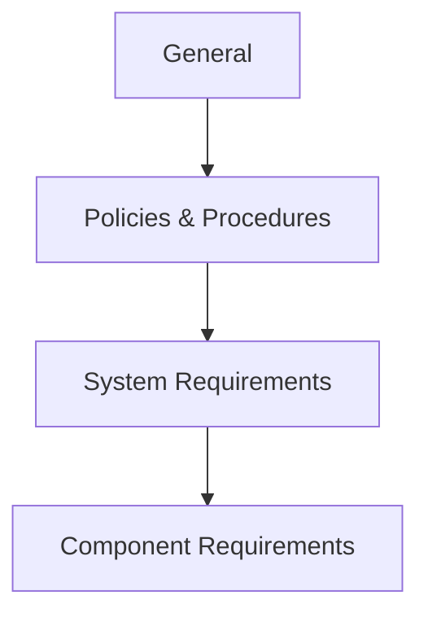

---

title: IEC 62443 Overview

category: Standards

version: 1.0.0

status: Stable

author: OT Security Handbook Project

classification: Public

last_reviewed: 2026-06-28

## review_cycle: Annual

# Purpose

This document provides an engineering-oriented overview of the IEC 62443 series of standards.

Rather than summarizing every individual standard, it explains how OT Security Architects should use IEC 62443 throughout the lifecycle of Industrial Automation and Control Systems (IACS).

IEC 62443 should be viewed as an engineering framework rather than a checklist.

---

# What is IEC 62443?

IEC 62443 is an international series of standards developed to improve cybersecurity within Industrial Automation and Control Systems (IACS).

Unlike enterprise cybersecurity frameworks, IEC 62443 was specifically designed for industrial environments where:

* Safety is critical.
* Availability is essential.
* Long system lifecycles are common.
* Legacy equipment is frequently encountered.
* Operational continuity is a primary objective.

IEC 62443 provides guidance for asset owners, system integrators and product suppliers.

---

# Engineering Philosophy

IEC 62443 does not prescribe specific products or vendors.

Instead, it defines:

* engineering principles,
* cybersecurity capabilities,
* organizational processes,
* technical requirements,
* secure development practices.

Its goal is to build resilient industrial systems through systematic engineering rather than isolated technical controls.

---

# Who Uses IEC 62443?

The standard addresses three primary stakeholder groups.

| Stakeholder        | Primary Focus                                 |
| ------------------ | --------------------------------------------- |
| Asset Owners       | Secure operation and governance               |
| System Integrators | Secure architecture and system implementation |
| Product Suppliers  | Secure product development and maintenance    |

Each group has different responsibilities, but all contribute to the overall cybersecurity posture.

---

# Structure of IEC 62443

The IEC 62443 series is organized into four logical groups.

These groups collectively address governance, architecture, implementation and product security.

---

# IEC 62443 Family

For architects, the most relevant documents include:

| Standard      | Purpose                                               |
| ------------- | ----------------------------------------------------- |
| IEC 62443-1-x | Concepts and terminology                              |
| IEC 62443-2-x | Security management and operational processes         |
| IEC 62443-3-x | System architecture and security requirements         |
| IEC 62443-4-x | Secure product development and component requirements |

An architect will typically work primarily with Parts 2 and 3 while understanding the role of Parts 1 and 4.

---

# Core Concepts

Several concepts appear repeatedly throughout the standard.

They form the foundation of secure OT architectures.

---

## Zones

A Zone groups assets that share similar security requirements.

Examples:

* Safety systems
* PLC networks
* SCADA servers
* Engineering workstations
* Historian infrastructure

Zones simplify risk management and policy enforcement.

---

## Conduits

Conduits represent controlled communication paths between Zones.

Typical examples include:

* Firewalls
* Industrial routers
* Secure VPN gateways
* Data diodes
* OPC UA gateways

A conduit is more than a network cable—it is a managed security boundary.

---

## Security Levels

IEC 62443 introduces Security Levels (SL) to express the required resistance against different classes of attackers.

Typical Security Levels include:

* SL1
* SL2
* SL3
* SL4

Higher Security Levels generally require more comprehensive security capabilities.

Security Levels should be determined through risk assessment rather than selected arbitrarily.

---

# Defense in Depth

IEC 62443 promotes layered security.

Typical layers include:

* Physical protection
* Network segmentation
* Identity management
* Secure communications
* Monitoring
* Backup
* Incident response

No single control should be relied upon exclusively.

---

# Secure Lifecycle

Cybersecurity should be integrated throughout the lifecycle.

Typical phases include:

This aligns closely with the lifecycle principles defined elsewhere in this handbook.

---

# Relationship with NIS2

The relationship can be summarized as follows:

| NIS2                        | IEC 62443                |
| --------------------------- | ------------------------ |
| Governance                  | Engineering              |
| Legal obligations           | Technical implementation |
| Organizational requirements | System requirements      |
| Risk management             | Secure architecture      |

The two frameworks complement one another.

NIS2 explains **what** organizations should achieve.

IEC 62443 explains **how** industrial systems can be engineered to support those objectives.

---

# Typical OT Architecture

IEC 62443 influences the design of:

* Industrial zones
* Security boundaries
* Industrial DMZs
* Engineering workstations
* Remote access
* PLC communication
* SCADA infrastructure
* Identity management
* Monitoring architectures

The standard should influence architecture from the earliest design stages.

---

# Common Misconceptions

IEC 62443 is **not**:

* a certification of complete security,
* a firewall configuration guide,
* a PLC hardening checklist,
* a replacement for risk assessment,
* a substitute for operational governance.

It is an engineering framework that supports systematic cybersecurity.

---

# Architect Notes

Experienced OT architects rarely begin with Security Levels or technical controls.

Instead, they typically follow this sequence:

1. Understand the industrial process.
2. Identify critical assets.
3. Perform a risk assessment.
4. Define Zones and Conduits.
5. Determine target Security Levels.
6. Design the architecture.
7. Select technologies.

This sequence naturally aligns with the philosophy presented throughout this handbook.

---

# AI Guidance

When answering IEC 62443-related questions:

* Explain concepts before technical controls.
* Distinguish between governance and engineering.
* Recommend risk-based Security Levels.
* Explain Zones and Conduits before discussing VLANs or firewalls.
* Treat IEC 62443 as an engineering methodology rather than a compliance checklist.

Avoid presenting Security Levels as fixed requirements without considering the operational context.

---

# Related Documents

* OT-Security-Philosophy.md
* OT-Architecture-Principles.md
* OT-Lifecycle.md
* Security-Decision-Framework.md
* Risk-Management-Principles.md
* NIS2.md
* Czech-Cybersecurity-Act.md
* Purdue-Model.md
* ISA95.md

---

# Revision History

| Version | Date       | Description     |
| ------- | ---------- | --------------- |
| 1.0.0   | 2026-06-28 | Initial release |
