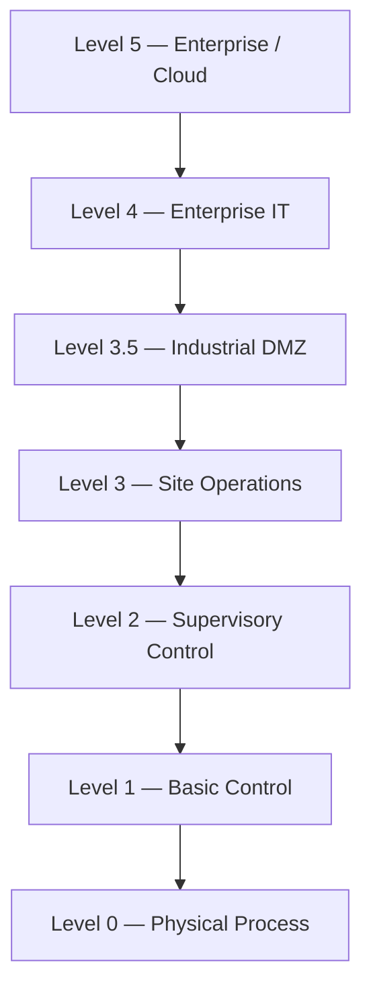

# Purpose

This document explains the Purdue Enterprise Reference Architecture (PERA) — the **Purdue Model** — from the perspective of an OT Security Architect.

Purdue is the **network-trust** reference model: it describes *where trust boundaries sit* and *what may connect to what* across an Industrial Automation and Control System (IACS). It is one of three complementary models used together in OT security design:

```
[NIS2 / Czech Cybersecurity Act]   ← What must be protected (regulatory)
        │
[IEC 62443]                        ← How to protect it (security requirements: zones, conduits, SL)
        │
[Purdue Model / ISA-95]            ← Where it sits (network trust) / What it does (function)
```

---

# Single Source of Truth (scope of this document)

To avoid duplication and drift, this document is deliberately narrow and delegates detail:

| Topic | Authoritative document |
|-------|------------------------|
| **Network trust levels & boundaries (L0–L5 + L3.5)** | **This document (Purdue-Model.md)** |
| Systems, functions, responsibilities and information flows at each level | [ISA95.md](ISA95.md) (functional hierarchy, Levels 0–4) |
| Zones, conduits, Security Levels (SL), FR/SR, risk assessment (SLRA) | [IEC62443.md](IEC62443.md) |
| Network segmentation implementation / firewall enforcement | [Network-Segmentation.md](Network-Segmentation.md), [Firewall-Design.md](Firewall-Design.md) |

> This document does **not** re-enumerate the systems that live at each level — that is the functional view owned by ISA-95. It describes each level only as a **trust boundary**.

---

# What Is the Purdue Model?

The Purdue Model is a layered reference architecture originally developed by Theodore J. Williams and the Purdue University Consortium for Computer Integrated Manufacturing (CIM) around 1989–1992. Its original goal was **not** cybersecurity — it described information/data flows in fully automated manufacturing. It was later adopted (via ISA-99, now IEC 62443, and NIST SP 800-82) as the de-facto reference for **ICS network trust architecture**.

Today it is used to understand industrial architecture, **define trust boundaries**, support network segmentation, organize cybersecurity controls, and communicate architecture between engineering teams.

**The Purdue Model is a reference architecture — not a mandatory network topology.**

---

# Engineering Philosophy

The Purdue Model is **not** about VLANs, IP addressing or firewall placement.

It is a model describing **which systems should communicate, why they communicate, and where trust boundaries should exist.** Architecture should follow operational and safety requirements rather than forcing systems into rigid layers. VLANs, routing and firewalls are *implementations* of the trust boundaries Purdue helps identify — see [Network-Segmentation.md](Network-Segmentation.md) and [Firewall-Design.md](Firewall-Design.md).

---

# Purdue Levels as Trust Boundaries



Each level is described below by its **trust role only**. For the systems and functions that reside at each level, see [ISA95.md](ISA95.md).

| Level | Trust role (network/security view) |
|-------|-----------------------------------|
| **L0 — Physical Process** | Field instrumentation (sensors, actuators, drives, final elements). No external reachability; integrity of measurement and actuation is paramount. |
| **L1 — Basic Control** | Controllers (PLC, RTU, DCS controllers, safety controllers). Highest availability; must be isolated from enterprise networks; often the last device before physical harm. |
| **L2 — Supervisory Control** | Operator-facing supervisory systems (HMI, SCADA runtime, alarming). Restricted, explicit conduits upward; no direct enterprise reachability. |
| **L3 — Site Operations** | Operational-support systems (historian, engineering workstations, OT domain services, patch, backup, local monitoring). Operational centre of the OT environment; must not create an unbrokered IT↔OT path. |
| **L3.5 — Industrial DMZ** | Brokering **termination zone** between IT and OT (see below). Not part of the original Purdue Model; a security best practice. |
| **L4 — Enterprise IT** | Corporate systems (ERP, Active Directory, email, SIEM, identity providers). Outside the OT trust boundary; direct communication with L2/L1 must be avoided. |
| **L5 — Enterprise / Cloud** | Cloud platforms, SaaS, business analytics, data lakes and AI platforms. Increasingly interact with OT, but only through **controlled interfaces terminating in the Industrial DMZ** — never directly to control networks. |

> **Note on L0 numbering:** in the security/Purdue reading, Level 0 covers the physical process and its field instrumentation. ISA-95 draws the L0 line at the physical process itself; the two are consistent for security purposes (see [ISA95.md](ISA95.md)).

---

# The Critical Trust Boundaries

Interpret the Purdue Model primarily as a set of trust boundaries where security controls must be strongest:

* **Enterprise ↔ OT** — the single most critical boundary; every legitimate reason to connect (historian feeds, patching, remote access) is also an attack path. Broker through the Industrial DMZ.
* **Vendor ↔ OT** — remote/maintenance access must terminate in the DMZ (jump server, MFA, session recording), never directly in the control network. See [Secure-Remote-Access.md](Secure-Remote-Access.md).
* **Safety ↔ Process Control** — the Safety Instrumented System (SIS) is a separate, most-restricted trust boundary; compromise removes the last line of physical protection.
* **Engineering ↔ Operations** — engineering traffic is *administrative* traffic and needs stronger controls than operational traffic.

These boundaries become IEC 62443 **zones and conduits** during design — see [IEC62443.md](IEC62443.md).

---

# Level 3.5 — Industrial DMZ (trust role)

The Industrial DMZ (IDMZ) is the **only** controlled path between enterprise IT (L4/L5) and OT (L3 and below). It is a **termination zone, not a transit zone**: connections from IT terminate in the DMZ, connections from OT terminate in the DMZ, and **no connection passes through end-to-end**.

For the detailed IDMZ system inventory (historian replica, jump/bastion host, patch staging, OPC UA proxy, log relay, dual firewalls) and its design rules, see [ISA95.md](ISA95.md) → *Level 3.5 — Industrial DMZ*, and the enforcement detail in [Network-Segmentation.md](Network-Segmentation.md) and [Firewall-Design.md](Firewall-Design.md).

---

# Modern Purdue Architecture

Modern industrial environments increasingly extend beyond the traditional hierarchy:

* IIoT devices and sensors that report directly to cloud or edge services.
* Edge computing that processes data at L1/L2 and forwards selectively upward.
* Cloud-based historians and analytics (L5) consuming OT data.
* Remote engineering and vendor access from outside the plant.
* Managed SOC / SIEM services consuming OT telemetry.
* OPC UA over secure networks that spans several levels.

These technologies **do not invalidate the Purdue Model.** They introduce **additional trust relationships** that must be identified and controlled rather than left implicit. The perimeter becomes less about a physical hierarchy and more about explicit, authenticated, monitored trust boundaries — which is exactly what Purdue was always meant to make visible. Where the rigid level hierarchy no longer maps cleanly (e.g. an IIoT sensor talking straight to cloud), fall back to the IEC 62443 **zone-and-conduit** analysis, which is model-agnostic (see [IEC62443.md](IEC62443.md)).

---

# Relationship with ISA-95

Purdue and ISA-95 share the same level numbering (ISA-95 derived it from PERA) but answer different questions: **Purdue = network trust boundaries ("where");** **ISA-95 = functions, responsibilities and information ownership ("what").** ISA-95 defines Levels 0–4 (no native L5 or L3.5); the Purdue security reading adds L5 (enterprise/cloud) and L3.5 (Industrial DMZ). Use ISA-95 to understand what exists and why, then Purdue to map it to trust levels. Full functional detail: [ISA95.md](ISA95.md).

---

# Relationship with IEC 62443

The Purdue Model and IEC 62443 complement one another. Purdue helps **identify candidate trust boundaries**; IEC 62443 turns them into **zones** (assets with shared security requirements) and **conduits** (controlled paths), assigns **Security Levels**, and verifies them via risk assessment. The **authoritative security construct is zones and conduits, not Purdue levels** — later IEC 62443 editions deliberately de-emphasize the direct PERA link because rigid levels map poorly onto modern IIoT/edge/cloud designs. Full detail: [IEC62443.md](IEC62443.md) → *Zones and Conduits*, *Security Levels (SL)*.

---

# Common Mistakes

* Treating Purdue as a mandatory network *design* (it is a reference model, not a topology).
* Connecting enterprise systems directly to L2/L1 (PLC) networks.
* Omitting the Industrial DMZ for IT↔OT communication.
* Assuming VLANs alone provide adequate segmentation (they do not — see [Network-Segmentation.md](Network-Segmentation.md)).
* Mixing engineering workstations with office endpoints, or safety with basic control, without justification.
* Bypassing trust boundaries "temporarily" for convenience and never closing the path.
* Assuming modern (IIoT/cloud) connectivity is out of scope because "it doesn't fit a level."

---

# Architect Notes

The Purdue Model remains valuable because it forces structured thinking about trust. Experienced architects use it to answer: *Which systems should communicate? Where should trust boundaries exist? Which communications require inspection? Which identities require privileged access? Where should monitoring occur?* Use the model to support engineering decisions and to make trust relationships explicit — not to restrict innovation or to dictate wiring.

---

# AI Guidance

When answering Purdue-related questions:

* Explain that Purdue is a **network-trust reference architecture**, not a mandatory topology, and one of three complementary models (PERA / ISA-95 / IEC 62443).
* Focus on **trust boundaries**, not network layers alone; treat Enterprise↔OT, Vendor↔OT, Safety↔Control and Engineering↔Operations as the critical boundaries.
* Recommend an Industrial DMZ for all enterprise-to-OT communication, and controlled interfaces (via the IDMZ) for L5/cloud and IIoT.
* Delegate: for **systems/functions per level** refer to [ISA95.md](ISA95.md); for **zones/conduits/SL** refer to [IEC62443.md](IEC62443.md); for **implementation** refer to [Network-Segmentation.md](Network-Segmentation.md) and [Firewall-Design.md](Firewall-Design.md).
* Explain that zones and conduits — not Purdue levels — are the authoritative IEC 62443 construct, and that modern IIoT/edge/cloud architectures are handled by zone/conduit analysis when the level hierarchy no longer fits.
* Avoid describing Purdue as the only valid OT architecture.

---

# Related Documents

* [ISA95.md](ISA95.md) — functional hierarchy (systems, functions, information flows per level).
* [IEC62443.md](IEC62443.md) — zones, conduits, Security Levels, risk assessment.
* [Network-Segmentation.md](Network-Segmentation.md) — implementing trust boundaries.
* [Firewall-Design.md](Firewall-Design.md) — enforcing conduits.
* [Secure-Remote-Access.md](Secure-Remote-Access.md) — vendor/remote access across the Enterprise↔OT boundary.
* [Identity-Management.md](Identity-Management.md) — identities crossing trust boundaries.
* [NIS2.md](NIS2.md), [Czech-Cybersecurity-Act.md](Czech-Cybersecurity-Act.md) — regulatory drivers.

---

# Revision History

| Version | Date       | Description     |
| ------- | ---------- | --------------- |
| 1.0.0   | 2026-06-28 | Initial release |
| 1.1.0   | 2026-07-01 | Refactored to Variant A (network-trust reference model only): removed per-level functional/system enumerations that duplicated ISA95.md and replaced them with trust-role descriptions plus delegation; added explicit single-source-of-truth table; retained and sharpened the unique content (Level 5 enterprise/cloud, Modern Purdue / dissolving perimeter, network-trust framing); clarified that zones/conduits (not Purdue levels) are the authoritative IEC 62443 construct; fixed and normalized all cross-reference links (`IEC62443-Overview.md` → `IEC62443.md`, valid relative links); pruned Related Documents to existing corpus files |
