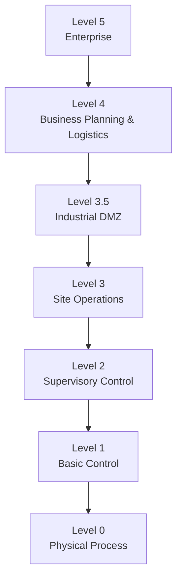

---

title: Purdue Enterprise Reference Architecture (PERA) Model

category: Standards

version: 1.0.0

status: Stable

author: OT Security Handbook Project

classification: Public

last_reviewed: 2026-06-28

## review_cycle: Annual

# Purpose

This document explains the Purdue Enterprise Reference Architecture (PERA) model from the perspective of an OT Security Architect.

Rather than describing Purdue as a fixed network topology, this document presents it as an architectural model that helps separate responsibilities, trust boundaries and security domains within Industrial Automation and Control Systems (IACS).

---

# What is the Purdue Model?

The Purdue Model is a layered reference architecture originally developed to describe industrial information flows.

Although created before modern cybersecurity became a primary concern, it remains one of the most widely used models for structuring industrial environments.

Today it is primarily used to:

* understand industrial architecture,
* define trust boundaries,
* support network segmentation,
* organize cybersecurity controls,
* communicate architecture between engineering teams.

The Purdue Model should be considered a reference architecture—not a mandatory implementation.

---

# Engineering Philosophy

The Purdue Model is not about VLANs.

It is not about IP addressing.

It is not about firewall placement.

It is a model describing **which systems should communicate, why they communicate and where trust boundaries should exist.**

Architecture should follow operational requirements rather than forcing systems into rigid layers.

---

# Purdue Levels

---

# Level 0 – Physical Process

This level contains the physical industrial process.

Typical assets include:

* Sensors
* Actuators
* Motors
* Valves
* Pumps
* Drives
* Field instrumentation

Primary objective:

Reliable and safe control of the physical process.

---

# Level 1 – Basic Control

Typical systems:

* PLCs
* RTUs
* Safety PLCs
* Remote I/O

Responsibilities:

* Process control
* Logic execution
* Interlocking
* Local automation

Availability is critical.

---

# Level 2 – Supervisory Control

Typical systems:

* HMI
* SCADA runtime
* Operator stations
* Alarm systems

Responsibilities:

* Process visualization
* Operator interaction
* Alarm handling
* Supervisory control

This layer connects operators with automation.

---

# Level 3 – Site Operations

Typical systems:

* Historians
* Engineering Workstations
* Batch servers
* Domain Controllers (OT)
* Patch Management
* Backup Servers
* Local monitoring
* Asset management

Responsibilities:

* Site operations
* Engineering activities
* Local cybersecurity
* Operational support

Level 3 often becomes the operational center of the OT environment.

---

# Level 3.5 – Industrial DMZ

The Industrial DMZ is not part of the original Purdue Model but is widely adopted as a cybersecurity best practice.

Typical systems:

* Jump Servers
* Remote Access Gateways
* Update Repositories
* OPC UA Gateways
* Reverse Proxies
* Log Collectors
* Data Replication Services

Primary objective:

Separate enterprise IT from industrial operations while allowing controlled communication.

---

# Level 4 – Enterprise IT

Typical systems:

* ERP
* Email
* Office applications
* Corporate Active Directory
* SIEM
* Identity Providers

Responsibilities:

* Business operations
* Enterprise identity
* Corporate services

Direct communication with Level 2 or Level 1 should generally be avoided.

---

# Level 5 – Enterprise / Cloud

Typical services:

* Cloud platforms
* Corporate data centers
* SaaS applications
* Business analytics
* Enterprise data lakes
* AI platforms

This level increasingly hosts services that interact with OT through controlled interfaces.

---

# Trust Boundaries

The Purdue Model should be interpreted as a series of trust boundaries.

Examples include:

* Enterprise ↔ OT
* Vendor ↔ OT
* Safety ↔ Process Control
* Engineering ↔ Operations

Security controls should be strongest at these boundaries.

---

# Modern Purdue Architecture

Modern industrial environments increasingly extend beyond the traditional Purdue hierarchy.

Examples include:

* IIoT devices
* Edge computing
* Cloud-based historians
* Remote engineering
* Managed SOC services
* OPC UA over secure networks

These technologies do not invalidate the Purdue Model.

Instead, they introduce additional trust relationships that require careful architectural consideration.

---

# Relationship with IEC 62443

The Purdue Model and IEC 62443 complement one another.

The Purdue Model helps organize systems into logical layers.

IEC 62443 provides guidance for securing communication between those layers through concepts such as:

* Zones
* Conduits
* Security Levels

Modern OT architectures frequently combine both models.

---

# Common Mistakes

Avoid:

* Treating Purdue as a mandatory network design.
* Connecting enterprise systems directly to PLC networks.
* Ignoring the Industrial DMZ.
* Assuming VLANs alone provide adequate segmentation.
* Mixing engineering workstations with office endpoints.
* Bypassing trust boundaries for convenience.

---

# Architect Notes

The Purdue Model remains valuable because it encourages structured thinking.

Experienced architects use Purdue to answer questions such as:

* Which systems should communicate?
* Where should trust boundaries exist?
* Which communications require inspection?
* Which identities require privileged access?
* Where should monitoring occur?

The model should support engineering decisions rather than restrict innovation.

---

# AI Guidance

When answering Purdue-related questions:

* Explain that Purdue is a reference architecture.
* Focus on trust boundaries rather than network layers alone.
* Recommend Industrial DMZs for enterprise-to-OT communication.
* Explain how Purdue integrates with IEC 62443 Zones and Conduits.
* Consider modern architectures involving cloud, edge computing and IIoT.

Avoid describing Purdue as the only valid OT architecture.

---

# Related Documents

* IEC62443-Overview.md
* OT-Architecture-Principles.md
* Security-Decision-Framework.md
* OT-Lifecycle.md
* Network-Segmentation.md
* ISA95.md
* Identity-Management.md
* Secure-Remote-Access.md

---

# Revision History

| Version | Date       | Description     |
| ------- | ---------- | --------------- |
| 1.0.0   | 2026-06-28 | Initial release |
